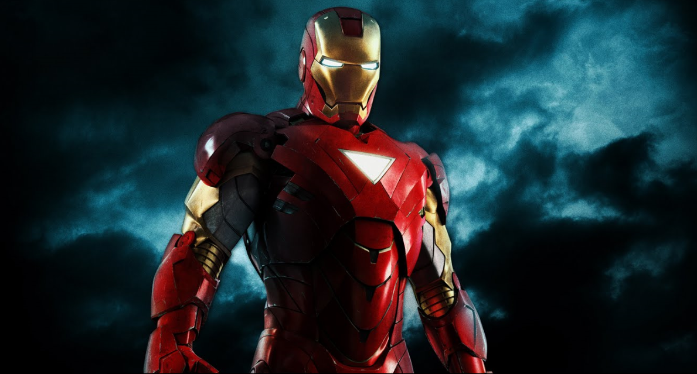

<html>
    <style type="text/css">
        *{
        margin:0px;
        padding:0px;
        }
        body, #S1{background-color: #FF9;
        font-family: times new roman;
        color: #009;
        position: relative;
        }
        #S1{
        width: 900px;
        margin: 0px auto;
       }
        #S2 {position: absolute;
        top: 0px;
        left: 0px;
       }
    
    </style>
    <body>
    <div id="S1">
        
        <div id="S2">
         _WELCOME TO MY WORLD_

Hi !!! I'm a undergard of PUNE UNIVERSITY and completed my Bachelor's in Instrumentation & Control Engineeing.


## Projects
<li>Designing and study of Quadcopter.</li>
<li>Programmable DC Load.</li>
        ### Markdown
_Times new roman_
Markdown is a lightweight and easy-to-use syntax for styling your writing. It includes conventions for

```markdown
Syntax highlighted code block

# Header 1
## Header 2
### Header 3

- Bulleted
- List

1. Numbered
2. List

**Bold** and _Italic_ and `Code` text

[Link](url) and 
```

For more details see [GitHub Flavored Markdown](https://guides.github.com/features/mastering-markdown/).

### Jekyll Themes

Your Pages site will use the layout and styles from the Jekyll theme you have selected in your [repository settings](https://github.com/omkarbhoite25/Omkar/settings). The name of this theme is saved in the Jekyll `_config.yml` configuration file.

### Support or Contact

Having trouble with Pages? Check out our [documentation](https://help.github.com/categories/github-pages-basics/) or [contact support](https://github.com/contact) and we’ll help you sort it out.

            </div>
    </div>
    </body>
</html>


    

